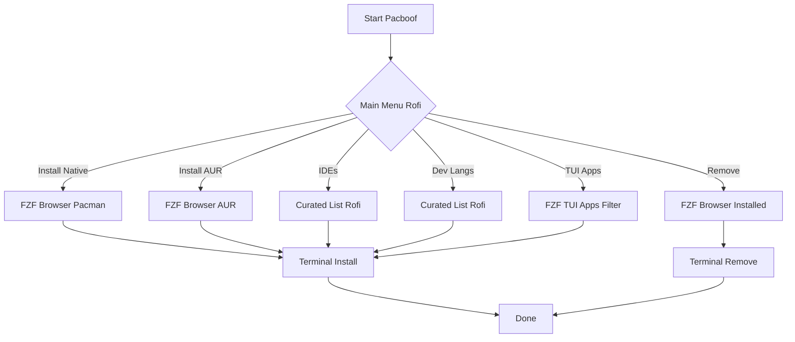

# pacboof

A simple, beautiful Arch Linux package manager<p align="center">
  
  
  <br>
  
  
</p>

## ✨ Features

- **Interactive**: Browse all packages using `fzf`
- **Native & AUR**: Manage official and AUR packages seamlessly
- **Curated Lists**: Quick install for popular IDEs and languages
- **Smart Removal**: Uninstall packages with multi-select
- **Themed**: Includes a custom modern Rofi theme

## How it Works



## Installation

Manually install by cloning the repository:

```bash
git clone https://github.com/yourusername/pacboof.git
cd pacboof
./install.sh
```

This installs `pacboof` to `~/.local/bin/` and sets up the theme.

## Usage

Simply run from your terminal:

```bash
pacboof
```

Or launch **Pacboof** from your application menu.

### Menu Options

1. **Install**: Browse native repositories (pacman)
2. **Install AUR**: Browse AUR (yay)
3. **Remove**: Browse installed packages
4. **IDEs**: VS Code, PyCharm, Neovim, etc.
5. **Development**: Python, Go, Rust, Node.js, etc.
6. **TUI Apps**: Browse CLI tools

## Dependencies

Required dependencies (installed automatically):
- `rofi`: Menu interface
- `fzf`: Package browser
- `yay`: AUR helper
- `pacman`: Native package manager

## 🐛 Troubleshooting & Recovery

Pacboof includes an interactive crash handler. If something goes wrong, you won't be left in the dark.

### Interactive Error Menu
If a command fails, a menu will pop up offering to:
*   **📂 Open Log File**: Instantly view `~/.local/state/pacboof/pacboof.log`.
*   **📋 Copy Error**: Copy the error details to report to the developer.

### Common Issues & Fixes

**Scenario 1: "fzf not found"**
*   **Log shows**: `[ERROR] Command 'fzf' exited with status 127`
*   **Fix**: Install missing dependency: `sudo pacman -S fzf`

**Scenario 2: "yay not found"**
*   **Log shows**: `[ERROR] Command 'yay' exited with status 127`
*   **Fix**: Install `yay` (or use `paru` if configured).

**Scenario 3: "Transaction failed"**
*   **Log shows**: `[ERROR] Command 'sudo pacman -S package' exited with status 1`
*   **Cause**: You might have cancelled the password prompt or have conflicting packages.
*   **Fix**: Run `sudo pacman -Syu` manually to check for system issues.

### Logs Location
`~/.local/state/pacboof/pacboof.log`

## Contributing

We welcome contributions! Please see [CONTRIBUTING.md](CONTRIBUTING.md) for details.

## License

MIT License
