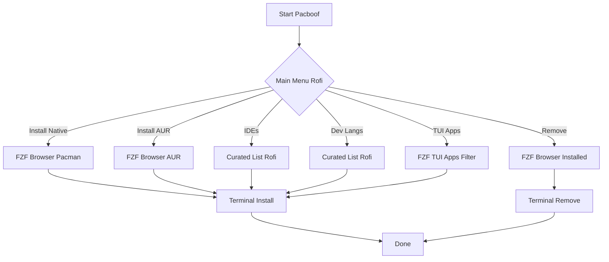

# pacboof

A simple, beautiful Arch Linux package manager using rofi & fzf.


## Features

- **Interactive**: Browse all packages using `fzf`
- **Native & AUR**: Manage official and AUR packages seamlessly
- **Curated Lists**: Quick install for popular IDEs and languages
- **Smart Removal**: Uninstall packages with multi-select
- **Themed**: Includes a custom modern Rofi theme

## How it Works



## Installation

Manually install by cloning the repository:

```bash
git clone https://github.com/yourusername/pacboof.git
cd pacboof
./install.sh
```

This installs `pacboof` to `~/.local/bin/` and sets up the theme.

## Usage

Simply run from your terminal:

```bash
pacboof
```

Or launch **Pacboof** from your application menu.

### Menu Options

1. **Install**: Browse native repositories (pacman)
2. **Install AUR**: Browse AUR (yay)
3. **Remove**: Browse installed packages
4. **IDEs**: VS Code, PyCharm, Neovim, etc.
5. **Development**: Python, Go, Rust, Node.js, etc.
6. **TUI Apps**: Browse CLI tools

## Dependencies

Required dependencies (installed automatically):
- `rofi`: Menu interface
- `fzf`: Package browser
- `yay`: AUR helper
- `pacman`: Native package manager

## Contributing

We welcome contributions! Please see [CONTRIBUTING.md](CONTRIBUTING.md) for details.

## License

MIT License
